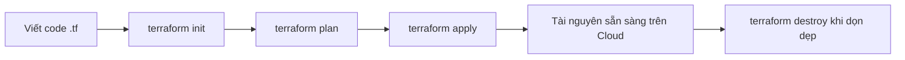
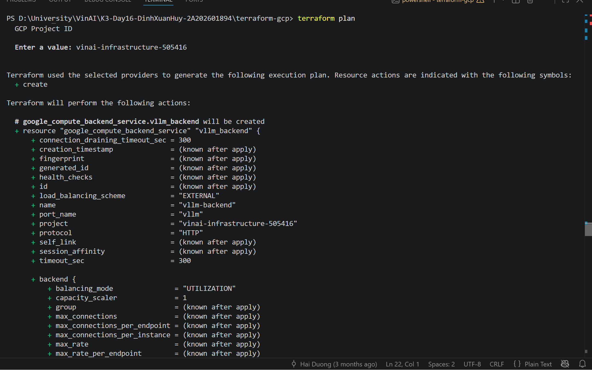
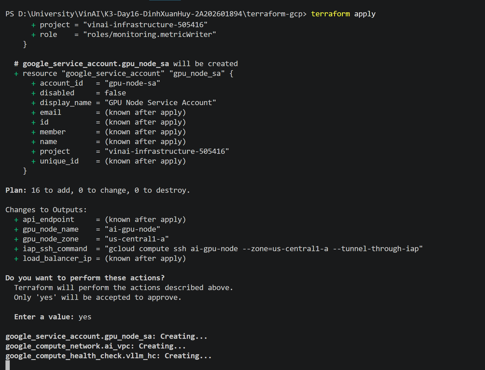
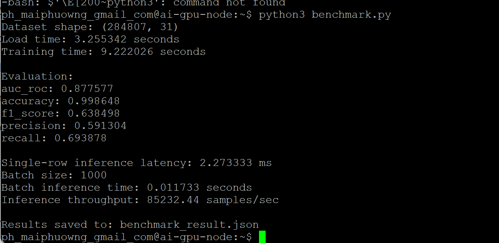
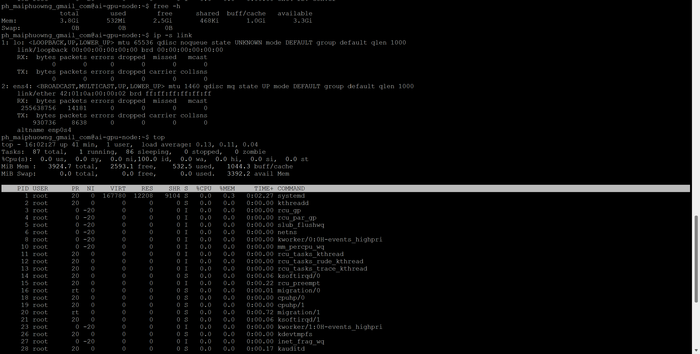
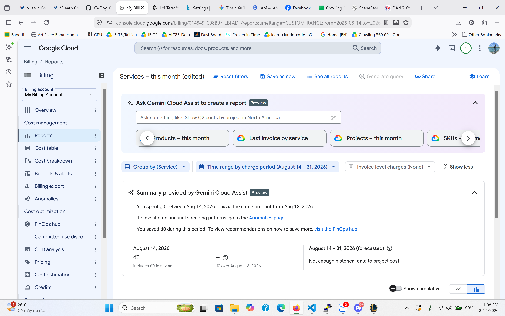

# Báo Cáo Thực Hành: Tổng Quan Terraform & Kết Quả Benchmark

---

## 1. Tìm Hiểu Về Terraform (Infrastructure as Code)

### 1.1. Terraform là gì?
**Terraform** là một công cụ **Infrastructure as Code (IaC)** mã nguồn mở nổi tiếng do **HashiCorp** phát triển. 

Thay vì phải đăng nhập vào giao diện web (Console) của các nhà cung cấp Cloud (AWS, GCP, Azure,...) để nhấp chuột tạo máy chủ, cơ sở dữ liệu hay mạng thủ công, Terraform cho phép bạn **định nghĩa và quản lý toàn bộ hạ tầng đám mây bằng mã nguồn (code)**.

### 1.2. Các đặc điểm chính của Terraform
* **Khai báo theo trạng thái mong muốn (Declarative):** Bạn chỉ cần mô tả *hạ tầng mong muốn trông như thế nào*, Terraform sẽ tự tính toán các bước cần thiết để đạt được trạng thái đó.
* **Đa nền tảng (Multi-Cloud):** Hỗ trợ quản lý hạ tầng trên AWS, Google Cloud (GCP), Microsoft Azure, DigitalOcean, Kubernetes,... cùng lúc bằng một cú pháp thống nhất.
* **Quản lý phiên bản (Version Control):** Code hạ tầng có thể lưu trữ trên Git, giúp theo dõi lịch sử thay đổi, review code và khôi phục (rollback) khi cần.
* **Quản lý trạng thái (State Management):** Sử dụng file state (`terraform.tfstate`) để ghi nhớ hiện trạng thực tế của tài nguyên đã được tạo trên Cloud.

---

## 2. Các Lệnh Thao Tác Cloud Bằng Code (Terraform CLI)

Dưới đây là bảng tổng hợp các lệnh CLI quan trọng nhất để thực hiện các thao tác trên Cloud bằng code:

| Lệnh | Ý nghĩa & Chức năng |
| :--- | :--- |
| `terraform init` | **Khởi tạo:** Tải các Provider (AWS, GCP,...) và cấu hình các plugin cần thiết cho dự án. |
| `terraform fmt` | **Định dạng code:** Tự động căn chỉnh lại định dạng mã nguồn trong các file `.tf` cho đẹp và chuẩn. |
| `terraform validate` | **Kiểm tra cú pháp:** Xác minh xem cấu hình trong các file `.tf` có hợp lệ hay không. |
| `terraform plan` | **Xem trước (Dry-run):** So sánh code với trạng thái thực tế và hiển thị danh sách tài nguyên sẽ được **tạo mới (+)**, **thay đổi (~)** hoặc **xóa bỏ (-)** mà chưa tác động ngay vào Cloud. |
| `terraform apply` | **Thực thi:** Áp dụng các thay đổi lên Cloud (tạo/sửa máy chủ, VPC, S3 bucket...). Hệ thống sẽ hỏi xác nhận (`yes`) trước khi chạy. |
| `terraform destroy` | **Xóa hạ tầng:** Hủy bỏ và xóa toàn bộ tài nguyên Cloud đã tạo trong dự án này (dùng khi hoàn thành thử nghiệm/dọn dẹp). |
| `terraform show` | **Xem trạng thái hiện tại:** Hiển thị chi tiết thông tin các tài nguyên đang lưu trong file `terraform.tfstate`. |
| `terraform output` | **Xem giá trị đầu ra:** Hiển thị các thông tin mong muốn sau khi apply (ví dụ: IP công cộng của server, URL kết nối...). |

### Quy trình làm việc chuẩn (Standard Workflow)



---

## 3. Báo Cáo Kết Quả Thực Nghiệm (Benchmark Results)

Sau khi triển khai hạ tầng đám mây thành công với Terraform và chạy mô hình huấn luyện, dưới đây là kết quả đo lường chi tiết từ file `benchmark_results.json`:

### 3.1. Tổng quan Dataset & Thời gian huấn luyện

- **Số dòng dữ liệu (Rows):** 284,807 dòng
- **Số đặc trưng (Features):** 31 đặc trưng
- **Thời gian tải dữ liệu (Load Time):** `3.255` giây
- **Thời gian huấn luyện (Training Time):** `9.222` giây

### 3.2. Đánh giá chất lượng mô hình (Model Metrics)

| Chỉ số (Metric) | Giá trị | Đánh giá |
| :--- | :--- | :--- |
| **Accuracy** | `99.86%` (`0.998648`) | Độ chính xác tổng thể rất cao |
| **AUC-ROC** | `87.76%` (`0.877577`) | Khả năng phân loại phân biệt lớp tốt |
| **F1-Score** | `63.85%` (`0.638498`) | Cân bằng tốt giữa Precision & Recall |
| **Precision** | `59.13%` (`0.591304`) | Tỷ lệ dự đoán đúng trên các mẫu positive |
| **Recall** | `69.39%` (`0.693878`) | Khả năng phát hiện các mẫu positive |

### 3.3. Hiệu năng Inference (Inference Performance)

- **Độ trễ khi xử lý 1 mẫu (Single Row Latency):** `2.27` ms
- **Kích thước Batch:** `1,000` mẫu
- **Thời gian xử lý 1 Batch (Batch Inference Time):** `0.0117` giây
- **Tốc độ xử lý (Throughput):** `85,232.44` samples/second

### 3.4. Dữ liệu gốc JSON (`benchmark_results.json`)

```json
{
  "dataset": {
    "rows": 284807,
    "features": 31
  },
  "timing": {
    "load_time_seconds": 3.255342,
    "training_time_seconds": 9.222026
  },
  "metrics": {
    "auc_roc": 0.877577,
    "accuracy": 0.998648,
    "f1_score": 0.638498,
    "precision": 0.591304,
    "recall": 0.693878
  },
  "inference": {
    "single_row_latency_ms": 2.273333,
    "batch_size": 1000,
    "batch_inference_time_seconds": 0.011733,
    "throughput_samples_per_second": 85232.44
  },
  "best_iteration": null
}
```

---

## 4. Minh Họa Hình Ảnh Thực Hiện (TaskDone Screenshots)

Dưới đây là các hình ảnh minh chứng quá trình thực hành triển khai và kiểm thử hạ tầng trên Cloud:

### 4.1. Xem trước kế hoạch triển khai (`terraform plan`)


### 4.2. Thực thi triển khai hạ tầng thành công (`terraform apply`)


### 4.3. Kết quả huấn luyện & Benchmark mô hình


### 4.4. Theo dõi mức sử dụng tài nguyên (Resource Usage)


### 4.5. Quản lý chi phí & Hóa đơn Cloud (Cloud Billing)


---
*Báo cáo được khởi tạo tự động và tổng hợp đầy đủ kết quả thực hành.*
